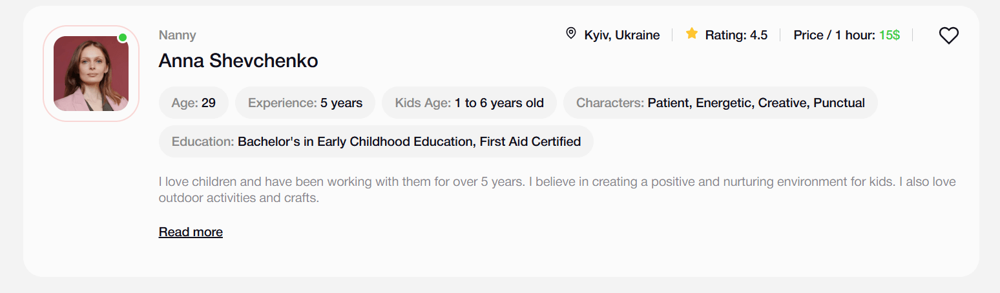
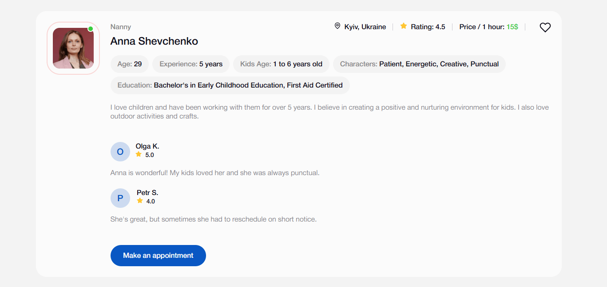
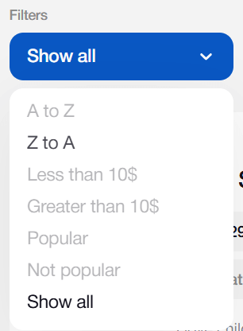
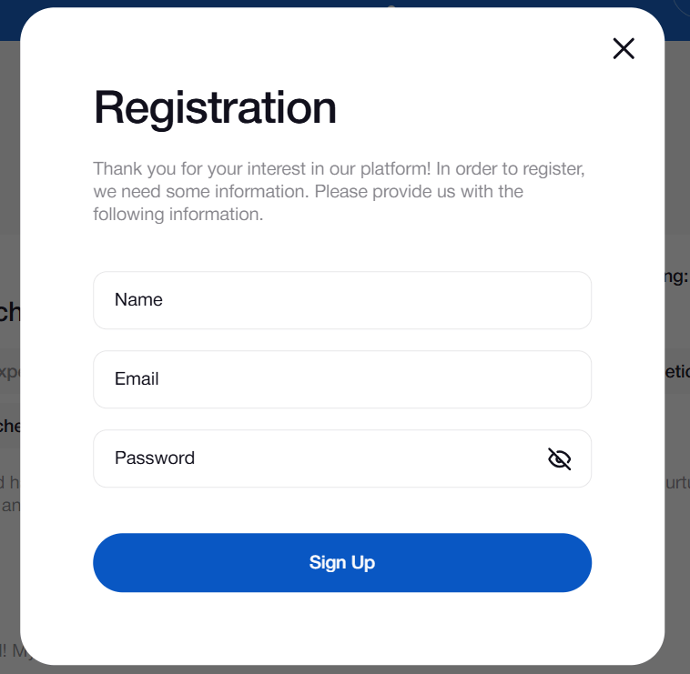
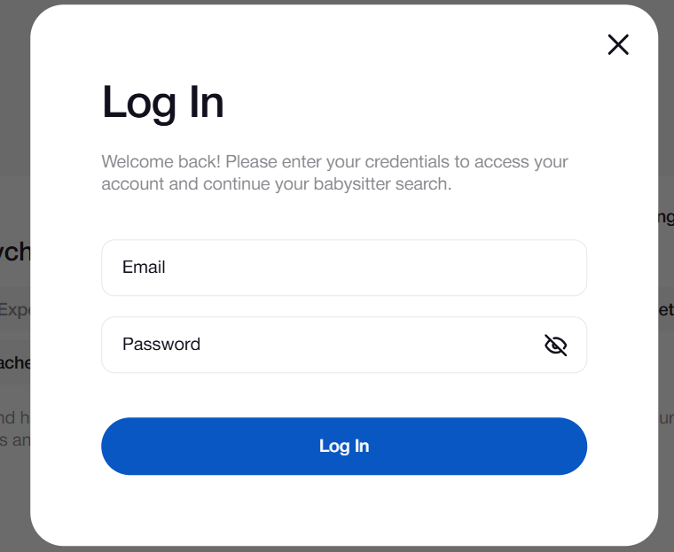

# Nannies Services

Nanny.Services is a web service that simplifies the process of finding a
qualified nanny for your child. The application allows you to browse the catalog
of available nannies, use filters to search by criteria, add nannies to your
favorites list, and quickly make an appointment.

## Badges


## Demo

https://nannies-kappa.vercel.app/

## Features

- **User Registration and Authentication:** Users can register with an Email and
  password or log in to an existing account. <a href="#authentication">View
  authentication screenshot</a>
- **View the nannies directory:** A list of all nannies in the database is
  available with a brief description of each one.
- **Filtering and Sorting:** Ability to filter and sort the list of nannies by
  criteria such as name (alphabetically), hourly price, and popularity (by
  rating), as well as reset filters to display all nannies.
  <a href="#filter">View filter screenshot</a>
- **User Reviews:** See what other users have to say about a specific nanny
  (expands when clicked to <a href='#read-more'>"Read more"</a>).
- **Favorites List:** Registered users can add nannies to their personal
  favorites list for easy access in the future. The favorites list is available
  on a separate page.
- **Make an Appointment:** Registered users can fill out the form to book an
  appointment with their chosen nanny (available after clicking
  <a href='#read-more'>"Read more"</a>).

## Tech Stack Overview

- **Frontend:**
  [](https://www.npmjs.com/package/vite/v/6.0.5)
  [ ](https://www.npmjs.com/package/react/v/18.3.1)
- **State Management:**
  [](https://www.npmjs.com/package/@reduxjs/toolkit/v/2.5.1)
  [ ](https://www.npmjs.com/package/react-redux/v/9.2.0)
  [ ](https://www.npmjs.com/package/redux-persist/v/6.0.0)
- **Routing:**
  [ ](https://www.npmjs.com/package/react-router-dom/v/7.1.3)
- **Backend & Database:**
  [ ](https://www.npmjs.com/package/firebase/v/11.2.0)
  [ ](https://firebase.google.com/docs/auth)  
   [ ](https://firebase.google.com/docs/database)
- **Forms and validation:**
  
  [ ](https://www.npmjs.com/package/yup/v/1.6.1)
- **UI and Helpers:**
  [ ](https://www.npmjs.com/package/react-modal/v/3.16.3)
  [ ](https://www.npmjs.com/package/react-toastify/v/11.0.5)
  [ ](https://www.npmjs.com/package/react-select/v/5.10.0)
  [ ](https://www.npmjs.com/package/dayjs/v/1.11.13)
  [](https://www.npmjs.com/package/clsx/v/2.1.1)
- **Stylization:**
  
- **Deployment:**
  [ ](https://vercel.com/home)


## Installation


**1. CLone the repository**:

```bash
  git clone https://github.com/yurii-tsyhykal/nannies.git
  cd nannies
```
**2. Install dependencies:** 
```bash
npm install
```

**Create .env file in the root directory with the following content:**

## Environment Variables

To run this project, you will need to add the following environment variables to
your .env file

`API_KEY`

`ANOTHER_API_KEY`

## Authors

- [@octokatherine](https://www.github.com/octokatherine)

## License

[MIT](https://choosealicense.com/licenses/mit/)

## Usage/Examples

<details id='read-more'><summary>View usage screenshots for nannies profile</summary>


</details>

<details id='read-more'><summary>View usage screenshots for filter</summary>

</details>

<details id='authentication'><summary>View usage screenshots for authentication</summary>



</details>
