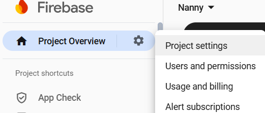
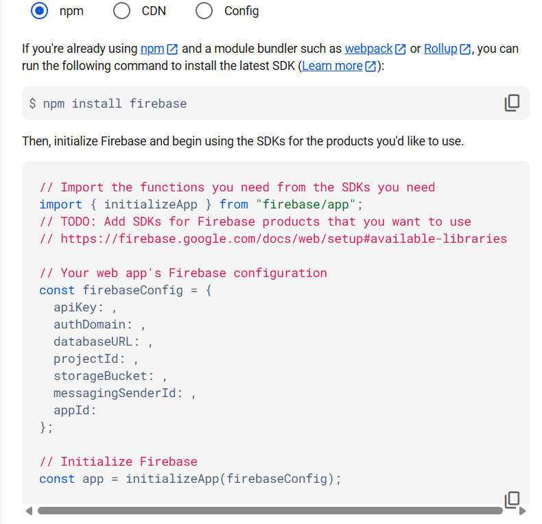

# Nannies Services

Nanny.Services is a web service that simplifies the process of finding a
qualified nanny for your child. The application allows you to browse the catalog
of available nannies, use filters to search by criteria, add nannies to your
favorites list, and quickly make an appointment.

## Demo

https://nannies-kappa.vercel.app/

## Features

- **User Registration and Authentication:** Users can register with an Email and
  password or log in to an existing account.
  [View authentication screenshot](#authentication)
- **View the nannies directory:** A list of all nannies in the database is
  available with a brief description of each one.
- **Filtering and Sorting:** Ability to filter and sort the list of nannies by
  criteria such as name (alphabetically), hourly price, and popularity (by
  rating), as well as reset filters to display all nannies.
  [View filter screenshot](#filter)
- **User Reviews:** See what other users have to say about a specific nanny
  (expands when clicked to ["Read more"](#read-more)).
- **Favorites List:** Registered users can add nannies to their personal
  favorites list for easy access in the future. The favorites list is available
  on a separate page.
- **Make an Appointment:** Registered users can fill out the form to book an
  appointment with their chosen nanny (available after clicking
  ["Read more"](#read-more)).

## Tech Stack Overview

- **Frontend:**
  [](https://www.npmjs.com/package/vite/v/6.0.5)
  [ ](https://www.npmjs.com/package/react/v/18.3.1)
- **State Management:**
  [](https://www.npmjs.com/package/@reduxjs/toolkit/v/2.5.1)
  [ ](https://www.npmjs.com/package/react-redux/v/9.2.0)
  [ ](https://www.npmjs.com/package/redux-persist/v/6.0.0)
- **Routing:**
  [ ](https://www.npmjs.com/package/react-router-dom/v/7.1.3)
- **Backend & Database:**
  [ ](https://www.npmjs.com/package/firebase/v/11.2.0)
  [ ](https://firebase.google.com/docs/auth)  
   [ ](https://firebase.google.com/docs/database)
- **Forms and validation:**
  
  [ ](https://www.npmjs.com/package/yup/v/1.6.1)
- **UI and Helpers:**
  [ ](https://www.npmjs.com/package/react-modal/v/3.16.3)
  [ ](https://www.npmjs.com/package/react-toastify/v/11.0.5)
  [ ](https://www.npmjs.com/package/react-select/v/5.10.0)
  [ ](https://www.npmjs.com/package/dayjs/v/1.11.13)
  [](https://www.npmjs.com/package/clsx/v/2.1.1)
- **Stylization:**
  
- **Deployment:**
  [ ](https://vercel.com/home)

## Installation and Setup

**Make sure you have installed:**

- 
- npm or yarn
- Git

**1. Clone the repository**:

```bash
  git clone https://github.com/yurii-tsyhykal/nannies.git
```

```bash
cd nannies
```

**2. Install dependencies:**

```bash
npm install
```

or

```bash
yarn install
```

**3. Settings Firebase Project:**

1. Go to the [Firebase Console](https://console.firebase.google.com/u/0/).
2. Sign in or create a Google Account.
3. Click "Create a Firebase Project" or select an existing project.
4. Follow the instructions to create a new Firebase project.
5. After creating a project go to its control panel.
6. In the left menu go to the "Build" section > select "Authentication":

- Click "Get Started".
- Go to the "Sign-in method" tab.
- Click on "Email/Password" and enable it. Save the changes.

7. In the left menu go to the "Build" section > select "Realtime Database":

- Click "Create Database".
- Select the database location.
- Select "Start in **test mode**" for easy local development (this will allow
  reading and writing data without authentication during the test period).
- The application expects nannies in the `/nannies` collection and favorites
  `/users/${uid}/favorites`. You will need to manually add the initial nannies
  to `/nannies` via the database web interface.

**4. Configure Environment Variables:**

1. Create a file `.env` in the root directory of your project.

2. Open the `.env.example` file and copy variables to a new `.env` file.

3. Fill in your Firebase configuration values in the `.env` file based on the
   structure provided in `.env.example`. You can find your configuration in
   Firebase project settings at
   [Firebase Console](https://console.firebase.google.com/u/0/)
   ([see the screenshots](#config-firebase)):
   - In Firebase Console in the left menu click on gear icon and go to the
     `"Project settings"` > `"General"` tabs.
   - Scroll down to the `"Your apps"` section.
   - Select and register the Web App (</> icon), if you haven't already done so.
   - Copy the configuration object that will be shown and paste the values into
     `.env`.

```dotenv

VITE_FIREBASE_API_KEY=your_api_key VITE_FIREBASE_AUTH_DOMAIN=your_auth_domain
VITE_FIREBASE_DATABASE_URL=your_database_url
VITE_FIREBASE_PROJECT_ID=your_project_id
VITE_FIREBASE_MESSAGING_SENDER_ID=your_messaging_sender_id
VITE_FIREBASE_APP_ID=your_app_id
```

**5. Start the development server:**

```bash
npm run dev
```

or

```bash
yarn dev
```

## Authors

- [@octokatherine](https://www.github.com/octokatherine)

## License

[MIT](https://choosealicense.com/licenses/mit/)

## Usage/Examples

<details id='read-more'><summary>View usage screenshots for nannies profile</summary>


</details>

<details id='filter'><summary>View usage screenshots for filter</summary>

</details>

<details id='authentication'><summary>View usage screenshots for authentication</summary>


</details>

<details id='config-firebase'><summary>View usage screenshots for find configuration in your Firebase project</summary>



</details>
